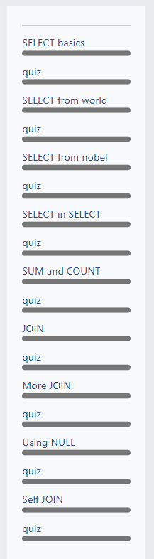

# SQLZoo
SQL zoo readme for spring 2025 advanced web programming project 4
project requirements listed on the odin project webpage:  
https://www.theodinproject.com/lessons/node-path-databases-sql-zoo 

this project did not require any code creation or deployment to complete
for this SQL zoo project, I completed tutorial lessons 0-9 as well as  
quizzes 0-9. below is a screenshot of the completed lessons and quizzes.

  
